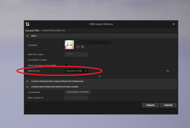

||
|-|
||
|モデル：[ヴィクトリア・ルービン](https://hub.vroid.com/characters/2792872861023597723/models/5013769147837660446)|
|マテリアルモード： 左 SubsurfaceProfile、右 MToonLit|

----

## 概要

UE5の機能を活かすためのオプションを紹介します。基本はUE4での操作と同じです。

このページには検証不十分な情報を多く含みます。ご利用にはご注意ください。UE5はアーリーアクセスです。
{: .notice--info}

ControlRigが正しく動作しない場合、後述の特殊文字用の機能を利用ください。これはUE5EAの不具合であり、将来的には修正されます。
{: .notice--warning}

----

## VRM4Uオススメ設定

以下の2点です。

 - インポート時、オプションを`SubsurfaceProfile`（リアル寄り）又は `MToon Lit`（アニメ寄り）にセットする。
 - 影にノイズが出る場合は、主光源や補助ライトで調整する。どうしても解消しない場合は従来のShadowmap手法に戻す

||
|-|
||

----

## 詳細：マテリアルの設定

用途に応じて、以下を選択ください。後から変更したい場合は [調整ウインドウ](../01_material/)を参照ください。

 - とにかくライトを反映したい -> SubsurfaceProfile
 - Toonらしさを残したい -> MToonLit

UE5の主要な機能、LumenによるGIとの関係性です。[Lumenの説明はこちら](https://docs.unrealengine.com/5.0/ja/RenderingFeatures/Lumen/)

|種別|UE5での見た目|Lumenの影響|
|-|-|:-:|
|SubsurfaceProfile|オススメ|有|
|Subsurface|影に不具合あり。UE4では問題無し|有|
|PBR(glTF2)|色が薄め。調整ウインドウで制御可|有|
|MToon Unlit|ライトの影響なし|無|
|MToon Lit|ライトの影響少、露出の影響あり|弱|

----

## 詳細：影手法の設定

影の精度が上がった影響で、意図しない陰影がつくことがあります。
主光源の向きを変えたり、補助ライトを利用して対処ください。[UE5の影の説明はこちら](https://docs.unrealengine.com/5.0/ja/RenderingFeatures/VirtualShadowMaps/)

あまりオススメしませんが、最終手段として影の手法を VirtualShadowMap から従来のShadowMapに戻すこともできます。
ProjectSettings または 調整パネルより変更できます。

||
|-|
||

## 日本語やピリオドを含むアセットのControlRig設定

以下の手順でセットアップしてください。

### MorphTargetに特殊文字があるアセット

インポート時に、'UE5EA work around' のチェックボックスをONにしてください（UE5EAではデフォルトON）。
MorphTarget内の特殊文字が全て'_'に置き換わります。名前は判別できなくなりますが、動作はします。

### 骨名に特殊文字があるアセット

インポート時に、'GenerateRenamedHumanoidMesh' のチェックボックスをONにしてください。
Humanoid骨がリネームされたSkeletonが生成されます。
IKRig生成時に、ControlRigに対象のSkeletalMeshを設定、テンプレートUIにリネームに対応したMetaアセットを設定してください。

|||
|-|-|
|||

## 開発最新版のUE5 を利用してみたい方の設定（上級者向け）

EpicのGithubより、`ue5-main`ブランチをご利用ください。
ただしEpicの開発状況によってビルドが通らなかったり、動作は不安定なことがあります。

VRM4UのUE5動作チェックには、`ue5-early-access` と `ue5-main`ブランチを利用しています。

