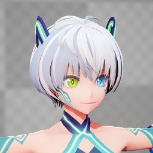

----
## VRM4Uとは

UE4で動作する、VRMファイルのインポーターです。

[導入はこのリンクから](./01_quick-start/)

[English (GoogleTranslate)](https://translate.google.com/translate?um=1&ie=UTF-8&hl=ja&client=tw-ob&sl=ja&tl=en&u=https%3A%2F%2Fruyo.github.io%2FVRM4U%2F)

----
## 特徴

|||
|----|----|
|||
|||

 - VRMファイルをインポートできます。
 - アニメーション
     - 手軽にリターゲット可能です。A-pose/T-pose、RIGが生成されます。
     - 揺れ骨にVRMSpringBoneを利用可能です。PhysicsAssetも選択できます。
     - 顔アニメ（Morphtarget・BlendShapeGroup）も利用可能です。
 - マテリアル
     - MToonを再現したマテリアル。影色の指定や、アウトラインの色・太さ調整、MatCapなどが全て適用されます。
     - PBR背景に合わせてキャラクタを描画できます。馴染ませるための拡張機能があります。
     - 既存のポストフィルタに加えて、レイトレースも併用可能です。
 - モバイル 利用可能
     - BoneMapリダクション機能により手軽に表示可能です。
     - 描画クオリティを選択できます。ロースペック対応です。
 - VR/AR 利用可能
     - シンプルな機能で構成しているため破綻しません。
     - 描画はForward/Deferred両方に対応しています。

