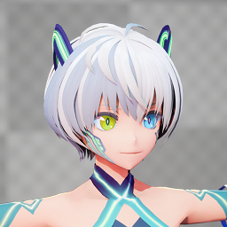
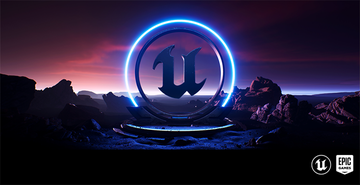
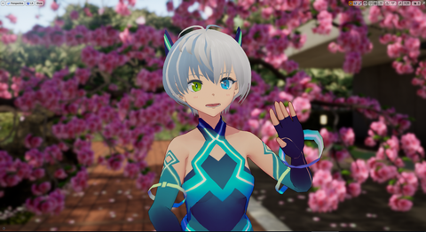
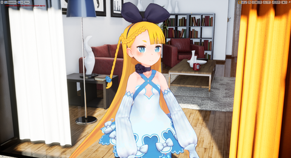
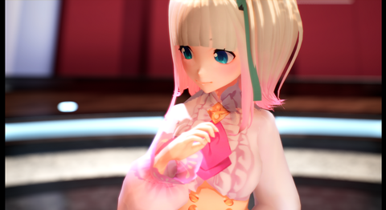
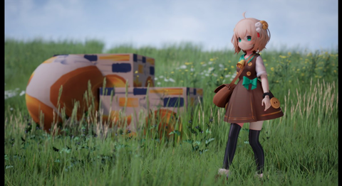

----
## VRM4Uとは

UnrealEngineで動作する、VRMファイルのインポート用プラグインです。
開発は[@はるべえ](https://twitter.com/ruyo_h)が個人で行っているものです。

[導入はこのリンクから](./01_quick-start/)

[English (GoogleTranslate)](https://translate.google.com/translate?um=1&ie=UTF-8&hl=ja&client=tw-ob&sl=ja&tl=en&u=https%3A%2F%2Fruyo.github.io%2FVRM4U%2F)

## UE5 対応しました！

[UE5向けの設定はこちら](./51_ue5/)

----

## 機能紹介動画



## 特徴

|||
|:-:|:-:|
|||
|||

スクリーンショットや動画は[**ギャラリーのページ**](./90_gallery/)に沢山あります

 - VRMファイルをインポートできます
 - アニメーション
     - 手軽にリターゲット可能です。A-pose/T-pose、BoneMapが生成されます。
     - 顔アニメ（Morphtarget・BlendShapeGroup）を利用可能です。
     - 揺れ骨にVRMSpringBone、PhysicsAssetを選択できます。
     - 汎用のControlRig、操作用のUMGがあります。
     - 外部アプリからモーションキャプチャデータを受け取れます。VMCプロトコルに対応しています。
     - UEMannequinからVRMモデルに、ランタイムでリターゲットできます。
     - UE5: IKRetargeterアセットを自動生成できます。EpicSkeletonからのリターゲット手順を簡略化できます。
 - マテリアル
     - MToonを再現したマテリアル。影色の指定や、アウトラインの色・太さ調整、MatCapなどが全て適用されます。
     - PBR背景に合わせて描画モードを切り替え・調整できます。
     - 既存のポストフィルタやレイトレースも同時に利用できます。
 - モバイル
     - BoneMapリダクション機能により、骨数を気にせず表示可能です。
     - 描画クオリティを切り替えできます。ロースペック対応です。
 - VR/AR
     - 描画はForward/Deferred両方に対応しています。
     - シンプルな機能で構成しているため破綻しません。
 - ランタイムロード
     - パッケージング後のEXEファイルから、ユーザの任意のVRMファイルを読み込むことができます。
     - アニメーションはランタイムでリターゲットできます。
 - UEとの相性の良さ
     - インポート後は標準的なSkeletalMeshアセットになります。
     - 対応するUEのバージョンは4.20~4.27, 5.0です（2022/04現在）最新版への対応も容易です。
 - VRM1.0βに順次対応中
     - VRM1.0のデータを、ある程度インポート可能です。
     - ローカル軸を保持するか、インポート時に選択できます。
     - MToonの新機能に対応しています。
     - ※試験的な実装です

----
## 雰囲気を知りたい

[簡易的ですがYoutubeの動画](https://www.youtube.com/channel/UC9Xuvwk9YLisxtNbTAjryDQ)や、ハッシュタグ[#VRM4U](https://twitter.com/hashtag/VRM4U)を参考にどうぞ

