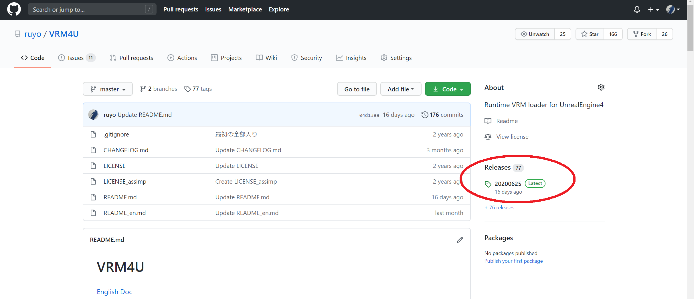

## プラグインセットアップ
こちらのリンクより、

https://github.com/ruyo/VRM4U


||
|-|
||


自分の利用するバージョンに合ったものをダンロードし、

||
|-|
|[  ](./assets/images/010_release.png)|

Pluginsに配置します。
例えばUE4のプロジェクト名が「MyGame」である場合は、
以下のようにファイルを配置してください。


```
-MyGame
  -MyGame.uproject
  -Config
  -Content
  -Plugins
    -VRM4U
      -VRM4U.uplugin
      - :
```

プラグインウィンドウにVRM4Uが表示されたら完了です。

||
|-|
||


## VRMモデルをインポートする

拡張子「.vrm」のファイルを、コンテンツブラウザにDrag&Dropしてください。

オプションウインドウが出ます。そのままimportをクリックしてください。

||
|-|
||

完了です。
**ただし上記SkeletalMeshだけでは完全な見た目にはなりません。**
見た目について次の章を参照ください。

||
|-|
||

アセットは標準のSkeletalMeshやMaterialと同じです。
MaterialはVRM4U内の共通のものをベースにしています。

